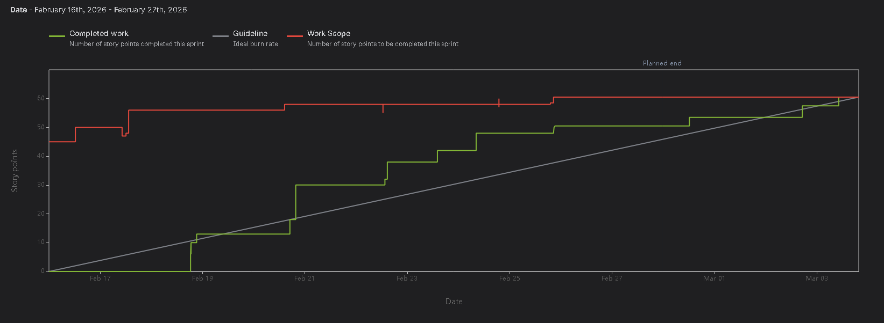
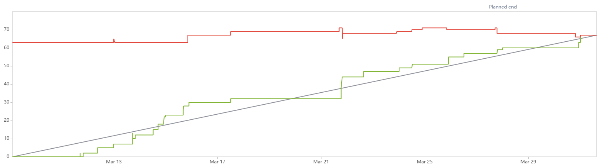

 # Meownvelope #

# Who you're working with #

* Emma Taylor
* Jake Olsen
* Nico San Esteban
* Steven Kertes Jr
* Treston Fallavollita

# What you're creating #

Meownvelope is a savings application that tracks and helps decide what your savings split should be, all while maintaining it for you.
We plan to incorpurate an intuitive savings technique of using envelopes to organize paper money by creating digital cateogories that users can place currency into.

# What is the goal? #

The Goal of our application is to help younger adults branch into starting their personal savings making it easy and seamless, all while adding some fun and creativity into it.

# Who you're doing it for, your audience? #

Our Target Audience / Demographic consists of:

* Young adults  (18-30)
* College Students
* Persons interested in financial growth
* Cat Lovers
* Anyone interested in low maintenance savings

# Why you're doing this, the impact or change you hope to make? #

Starting to save as a young adult can seem daunting to many. With so many complicated apps that expect you to have a certain level of knowledge about starting savings, it can be stressful to start building your future. With Meowvenlope, our main principle is to make starting savings as easy as possible by dumbing down definitions and tasks that may be presumed as difficult to an easy comprehension so that anyone can start building their future.

# Main Logo #

Designed by Nico San Esteban

# Technology #

Tools: 

* BitBucket
* Jira
* VS Code
* Slack
* OpenAI

Languages: 

* Python
* Flutter/Dart

Backend tools:

* Flask
* MySQL
* Docker
* Portainer

# Features #

### Website Development ###

Creating an initial website with basic information.

* As a user that enjoys more additional information,  I want a website so I can have an interactive page to contact support and see information about Meownvelope.

### Picking envelope categories ###

Creating an initial envolope that represents spending categories.

* As a user who has a hard time limiting digital spending, I want to create envelopes that will store digital bills and represent my different spending categories to visualize where my money will go each month.
* As a user with a significant partner, I would like to be able to have collaborative envelopes so my partner and I can budget together.

### Track money ###

Peering into your investment amount and showing money breakdown.

* As a user who prefers visual representations, I would like visual elements like pie charts so that I can better understand the distribution of my savings.
* As a user who needs budgeting to be approachable, I want to link my bank account to the app so that I can streamline my planning and keep it up to date with my income and expenses.

## Moving/Spending ##

Having the ability to move and spend the saved up amount.

* As a user who deals with inconsistent expenses each month I want to be able to move money between envelopes to take into account for unexpected expenses.
* As a user who struggles to keep up with repeated payments, I want the ability to add recurring payments for subscriptions and repeat purchases.

### Monthly summary ###

Summary of each month displaying a graph of monthly spending.

* As a user who get's overwhelmed by too many statistics, I want a friendly monthly overview so I can get a brief summary of my spending habits.
* As a user who lacks the motivation to save money, I would like cat themed encouragement in the form of daily saving streaks and badges, so that I can feel more inspired to save.

### AI Assistant ###

Having a personal AI assistent to help establish goals, answer questions, and make the application easy to navigate.

* As a user that struggles to navigate finance, I want a chat bot AI Assistant so I can receive guidance navigating the Meownvelope application and have my basic financial questions answered.
* As a user that has difficulty making financial plans, I want a built in AI Assistant that can analyze my past user data so that I can receive personalized recommendations to help plan for the future.

# Sprint 1 Review #
**Treston**: Created the backend server environment to host the teams webpage. Designed and implemented the apps local storage database.

- `Jira Task | SCRUM-82 | "Implement - Server Setup, SSH, Docker, Portainer, Flask"`
    - Jira Task: [SCRUM-28](https://cs3398-ewoks-s26.atlassian.net/browse/SCRUM-82?atlOrigin=eyJpIjoiNGZmODdiYzA1NmQxNGQ4MGExNmFiZDZiZjkwN2E2OTEiLCJwIjoiaiJ9)
    - BitBucket Branch: [SCRUM-82-server-setup](https://bitbucket.org/cs3398-ewoks-s26/meownvelope/branch/SCRUM-82-server-setup)
- `Jira Task | SCRUM-96 | "Design - Hive Data Model"`
    - Jira Task: [SCRUM-96](https://cs3398-ewoks-s26.atlassian.net/browse/SCRUM-96?atlOrigin=eyJpIjoiNjljZDc1Nzk3MWI0NDBlNWI1MjQyNzBiY2ExNTU4M2EiLCJwIjoiaiJ9)
    - BitBucket Branch: [SCRUM-96-design-hive-data-model](https://bitbucket.org/cs3398-ewoks-s26/meownvelope/branch/SCRUM-96-design-hive-data-model)
    - `Jira Subtask | SCRUM-102 | "Define Hive Schema and Business Rules"`
        - Jira Subtask: [SCRUM-102](https://cs3398-ewoks-s26.atlassian.net/browse/SCRUM-102?atlOrigin=eyJpIjoiMjkxMGE1MTk2MmViNDhlNjk2ZWVmZGI3NTQ4ODc1NDIiLCJwIjoiaiJ9)
        - BitBucket Branch: [SCRUM-102-define-hive-schema](https://bitbucket.org/cs3398-ewoks-s26/meownvelope/branch/SCRUM-102-define-hive-schema)
- `Jira Task | SCRUM-104 | "Implementation: Hive Setup and Repository"`
    - Jira Task: [SCRUM-104](https://cs3398-ewoks-s26.atlassian.net/browse/SCRUM-104?atlOrigin=eyJpIjoiZTM2Njk3ZTIxZmU1NGIxNGFmNjg4M2VhOTc5NDE5MDUiLCJwIjoiaiJ9)
    - BitBucket Branch: [feature/SCRUM-104-hive-flutter-initialization](https://bitbucket.org/cs3398-ewoks-s26/meownvelope/branch/feature/SCRUM-104-hive-flutter-initialization)
    - `Jira Subtask | SCRUM-103 | "Initialize Flutter Repo"`
        - Jira Subtask: [SCRUM-103](https://cs3398-ewoks-s26.atlassian.net/browse/SCRUM-103?atlOrigin=eyJpIjoiMjE1NWY4NTU0MDQxNDIyYTkzYzJhMmQ1YWJlOGJkMDYiLCJwIjoiaiJ9)
        - BitBucket Branch: [feature/SCRUM-103-initialize-flutter-repo](https://bitbucket.org/cs3398-ewoks-s26/meownvelope/branch/feature/SCRUM-103-initialize-flutter-repo)
    - `Jira Subtask | SCRUM-105 | "3A: Hive Setup and Core Repository Methods"`
        - Jira Subtask: [SCRUM-105](https://cs3398-ewoks-s26.atlassian.net/browse/SCRUM-105?atlOrigin=eyJpIjoiYjZmNmZmMTJhODQ2NGE3NmE0MDcwZDNhZTU3YTczOWEiLCJwIjoiaiJ9)
        - BitBucket Branch: [feature/SCRUM-105-3a-hive-setup](https://bitbucket.org/cs3398-ewoks-s26/meownvelope/branch/feature/SCRUM-105-3a-hive-setup)
- `Jira Task | SCRUM-170 | "Fix: Remake Hive Data Structure to Classes instead of Maps"`
    - Jira Task: [SCRUM-170](https://cs3398-ewoks-s26.atlassian.net/browse/SCRUM-170?atlOrigin=eyJpIjoiYTliZjJjYzIyZWYxNGE2NmFiYjQ2ZDRmNGNlMDY4OTciLCJwIjoiaiJ9)
    - BitBucket Branch: [hotfix/SCRUM-170-remake-hive-data-structure](https://bitbucket.org/cs3398-ewoks-s26/meownvelope/branch/hotfix/SCRUM-170-remake-hive-data-structure)
- `Jira Task | SCRUM-169 | "Implementation: HiveDatabase Automatic Index Finder"`
    - Jira Task: [SCRUM-169](https://cs3398-ewoks-s26.atlassian.net/browse/SCRUM-169?atlOrigin=eyJpIjoiMTcxNmI2OTg3ODM1NGNkYzhlOTE3MGFiM2VjZThjY2EiLCJwIjoiaiJ9)
    - BitBucket Branch: [feature/SCRUM-169-display-order-finder](https://bitbucket.org/cs3398-ewoks-s26/meownvelope/branch/feature/SCRUM-169-display-order-finder)
- `Jira Task | SCRUM-161 | "Fix Documentation"`
    - Jira Task: [SCRUM-161](https://cs3398-ewoks-s26.atlassian.net/browse/SCRUM-161?atlOrigin=eyJpIjoiZmU4NTk0NjMyODM2NGY4YjkzNjY1YTgyYmUxOGEzN2UiLCJwIjoiaiJ9)
    - BitBucket Branch: [SCRUM-161-fix-documentation](https://bitbucket.org/cs3398-ewoks-s26/meownvelope/branch/SCRUM-161-fix-documentation)

**Emma**: Collaborated with Nico on the UI design for the mobile app, tested functionality of the website, performed unit tests on hive database and envelope creation.

- `Jira Task | SCRUM-122 | "Basic UI design for the mobile app"`
    - Jira Task: [SCRUM-122](https://cs3398-ewoks-s26.atlassian.net/jira/software/projects/SCRUM/boards/1?selectedIssue=SCRUM-122)
    - BitBucket Branch: [design/SCRUM-122-app-design](https://bitbucket.org/cs3398-ewoks-s26/meownvelope/branch/design/SCRUM-122-app-design)
    - Pull Request: [PR #12](https://bitbucket.org/cs3398-ewoks-s26/meownvelope/pull-requests/12)

- `Jira Task | SCRUM-92 | "Unit Testing: Envelope Validation and HiveDatabase"`
    - Jira Task: [SCRUM-92](https://cs3398-ewoks-s26.atlassian.net/jira/software/projects/SCRUM/boards/1?selectedIssue=SCRUM-92)
    - BitBucket Branch: [SCRUM-92-unit-tests](https://bitbucket.org/cs3398-ewoks-s26/meownvelope/branch/SCRUM-92-unit-tests)
    - Pull Request: [PR #31](https://bitbucket.org/cs3398-ewoks-s26/meownvelope/pull-requests/31)

- `Jira Task | SCRUM-89 | "Unit Testing: Flask Route and Contact Endpoint Tests"`
    - Jira Task: [SCRUM-89](https://cs3398-ewoks-s26.atlassian.net/jira/software/projects/SCRUM/boards/1?selectedIssue=SCRUM-89)
    - BitBucket Branch: [SCRUM-89-unit-tests](https://bitbucket.org/cs3398-ewoks-s26/meownvelope/branch/SCRUM-89-unit-tests)
    - Pull Request: [PR #32](https://bitbucket.org/cs3398-ewoks-s26/meownvelope/pull-requests/32)

**Steven Kertes**: Designed the website page in Figma. Implemented the HTML and CSS of the website page. Implemented the Envelope Creation Page.

- `Jira Task | SCRUM-76 | "Design: Website UI/UX Mockup"`
    - Jira Task: [SCRUM-76](https://cs3398-ewoks-s26.atlassian.net/browse/SCRUM-76?atlOrigin=eyJpIjoiZTY5OGNjYWEyMWNhNDVmNjg2NWNkNmI4Njg3MTdhYzMiLCJwIjoiaiJ9)
    - BitBucket Branch: [feature/SCRUM-76-design-website-ui-ux-mockup](https://bitbucket.org/cs3398-ewoks-s26/meownvelope/branch/feature/SCRUM-76-design-website-ui-ux-mockup)
    - `Jira Subtask | SCRUM-77 | "1A: Sketch Low-Fidelity Wireframes | Included in SCRUM-76"`
        - Jira Subtask: [SCRUM-77](https://cs3398-ewoks-s26.atlassian.net/browse/SCRUM-77?atlOrigin=eyJpIjoiZGUzNzA1ZGY1ODE2NDkzYWFlOWM3YzBkODc4NWMwOWEiLCJwIjoiaiJ9)
        - BitBucket Branch: [feature/SCRUM-76-design-website-ui-ux-mockup](https://bitbucket.org/cs3398-ewoks-s26/meownvelope/branch/feature/SCRUM-76-design-website-ui-ux-mockup)
    - `Jira Subtask | SCRUM-78 | "1B: Build High-Fidelity Mockup" | Included in SCRUM-76`
        - Jira Subtask: [SCRUM-78](https://cs3398-ewoks-s26.atlassian.net/browse/SCRUM-78?atlOrigin=eyJpIjoiMGM0NTlmZDE2NGUyNGM2NTlmMDk1OGRlNWYzNmI3M2YiLCJwIjoiaiJ9)
        - BitBucket Branch: [feature/SCRUM-76-design-website-ui-ux-mockup](https://bitbucket.org/cs3398-ewoks-s26/meownvelope/branch/feature/SCRUM-76-design-website-ui-ux-mockup)
- `Jira Task | SCRUM-86 | "Implementation: HTML/CSS Templates"`
    - Jira Task: [SCRUM-86](https://cs3398-ewoks-s26.atlassian.net/browse/SCRUM-86?atlOrigin=eyJpIjoiMmY2NWMyNGFkMWE3NDY3ZjlmZDdlMTkyODExZGQxYjIiLCJwIjoiaiJ9)
    - BitBucket Branch: [feature/SCRUM-86-implementation-html-css-templat](https://bitbucket.org/cs3398-ewoks-s26/meownvelope/branch/feature/SCRUM-86-implementation-html-css-templat)
    - `Jira Subtask | SCRUM-87 | "5A: Build the 4-Page Jinja2 Templates | Included in SCRUM-86"`
        - Jira Subtask: [SCRUM-87](https://cs3398-ewoks-s26.atlassian.net/browse/SCRUM-87?atlOrigin=eyJpIjoiNWU0YWRhZWZjZjBlNDc3MGJhMmM4ZWFjMDg5MmNkOGYiLCJwIjoiaiJ9)
        - BitBucket Branch: [feature/SCRUM-86-implementation-html-css-templat](https://bitbucket.org/cs3398-ewoks-s26/meownvelope/branch/feature/SCRUM-86-implementation-html-css-templat)
    - `Jira Subtask | SCRUM-88 | "5B: Build the Contact Form and Wire to Flask" | Included in SCRUM-86"`
        - Jira Subtask: [SCRUM-88](https://cs3398-ewoks-s26.atlassian.net/browse/SCRUM-88?atlOrigin=eyJpIjoiYjJlZWI3MWU5ZDAyNDllZDlhZTdkMjk2NGFjNzNkMWUiLCJwIjoiaiJ9)
        - BitBucket Branch: [feature/SCRUM-86-implementation-html-css-templat](https://bitbucket.org/cs3398-ewoks-s26/meownvelope/branch/feature/SCRUM-86-implementation-html-css-templat)
- `Jira Task | SCRUM-172 | "Fix typos in webapp html & CSS"`
    - Jira Task: [SCRUM-172](https://cs3398-ewoks-s26.atlassian.net/browse/SCRUM-172?atlOrigin=eyJpIjoiMjY2YWUwNzFlYzk2NGM2N2I4OTgyMjI5NDMyMGZiZGYiLCJwIjoiaiJ9)
    - BitBucket Branch: [SCRUM-172-fix-typos-in-webapp-html](https://bitbucket.org/cs3398-ewoks-s26/meownvelope/branch/SCRUM-172-fix-typos-in-webapp-html)
- `Jira Task | SCRUM-171 | "Fix Envelope_creation_page location & comments"`
    - Jira Task: [SCRUM-171](https://cs3398-ewoks-s26.atlassian.net/browse/SCRUM-171?atlOrigin=eyJpIjoiN2I1YWEyZmUzMDRiNDRiODkwNzA0NDE0MTRlMDk3ZDMiLCJwIjoiaiJ9)
    - BitBucket Branch: [bugfix/SCRUM-171-fix-envelope_creation_page-loc](https://bitbucket.org/cs3398-ewoks-s26/meownvelope/branch/bugfix/SCRUM-171-fix-envelope_creation_page-loc)
- `Jira Task | SCRUM-168 | "Implementation: Envelope creating page"`
    - Jira Task: [SCRUM-168](https://cs3398-ewoks-s26.atlassian.net/browse/SCRUM-168?atlOrigin=eyJpIjoiYjVhYWU3ZTc3MjdkNDgwNmFmN2RkM2UzNTJiMzgyZjMiLCJwIjoiaiJ9)
    - BitBucket Branch: [feature/SCRUM-168-implementation-envelope-creati](https://bitbucket.org/cs3398-ewoks-s26/meownvelope/branch/feature/SCRUM-168-implementation-envelope-creati)

**Jake Olsen**: Collaborated with Steven on Figma design for the Web Application. Created a flask file to connect and use the existing HTML and CSS. Implemented support page & rules on submissions. Linked to gmail API key.

- `Jira Task | SCRUM-83 | "Implementation: Flask Routes, Contact Endpoint & Email Delivery"`
    - Jira Task: [SCRUM-83](https://cs3398-ewoks-s26.atlassian.net/browse/SCRUM-83?atlOrigin=eyJpIjoiMGMxYjlhYTM5MDlhNGExYTk3YWU3ODk4YzJhYWFhODEiLCJwIjoiaiJ9)
    - BitBucket Branch: [feature/SCRUM-83-implementation-flask-routes](https://bitbucket.org/cs3398-ewoks-s26/meownvelope/branch/feature/SCRUM-83-implementation-flask-routes)
    - `Jira Subtask | SCRUM-84 | "4A: Building the pages and contact form backend" | Included in SCRUM-83`
        - Jira Subtask: [SCRUM-84](https://cs3398-ewoks-s26.atlassian.net/browse/SCRUM-84?atlOrigin=eyJpIjoiMTM5NDhhNDM1YTZlNDA1YjliODg2MGE5M2U2YzM3NTEiLCJwIjoiaiJ9)
        - BitBucket Branch: [feature/SCRUM-83-implementation-flask-routes](https://bitbucket.org/cs3398-ewoks-s26/meownvelope/branch/feature/SCRUM-83-implementation-flask-routes)
    - `Jira Subtask | SCRUM - 85 | "4B: Implement Email Delivery and Manual Testing" | Included in SCRUM-83`
        - Jira Subtask: [SCRUM-85](https://cs3398-ewoks-s26.atlassian.net/browse/SCRUM-85?atlOrigin=eyJpIjoiMTM5NDhhNDM1YTZlNDA1YjliODg2MGE5M2U2YzM3NTEiLCJwIjoiaiJ9)
        - BitBucket Branch: [feature/SCRUM-83-implementation-flask-routes](https://bitbucket.org/cs3398-ewoks-s26/meownvelope/branch/feature/SCRUM-83-implementation-flask-routes)
- `Jira Task | SCRUM-79 | "Design: Contact Form Data Model & API Contract"`
    - Jira Task: [SCRUM-79](https://cs3398-ewoks-s26.atlassian.net/browse/SCRUM-79?atlOrigin=eyJpIjoiMGMxYjlhYTM5MDlhNGExYTk3YWU3ODk4YzJhYWFhODEiLCJwIjoiaiJ9)
    - BitBucket Branch: [feature/SCRUM-79-design-contact-form-data-model](https://bitbucket.org/cs3398-ewoks-s26/meownvelope/branch/feature/SCRUM-79-design-contact-form-data-model)
    - `Jira Subtask | SCRUM-80 | "2A: Define Form Validation Rules and Email Strategy" | Included in SCRUM-79`
        - Jira Subtask: [SCRUM-80](https://cs3398-ewoks-s26.atlassian.net/browse/SCRUM-80?atlOrigin=eyJpIjoiMTM5NDhhNDM1YTZlNDA1YjliODg2MGE5M2U2YzM3NTEiLCJwIjoiaiJ9)
        - BitBucket Branch: [feature/SCRUM-79-design-contact-form-data-model](https://bitbucket.org/cs3398-ewoks-s26/meownvelope/branch/feature/SCRUM-83-implementation-flask-routes)
    - `Jira Subtask | SCRUM - 81 | "2B: Define API Contract and Flask Route Strategy" | Included in SCRUM-79`
        - Jira Subtask: [SCRUM-81](https://cs3398-ewoks-s26.atlassian.net/browse/SCRUM-15?atlOrigin=eyJpIjoiMTM5NDhhNDM1YTZlNDA1YjliODg2MGE5M2U2YzM3NTEiLCJwIjoiaiJ9)
        - BitBucket Branch: [feature/SCRUM-79-design-contact-form-data-model](https://bitbucket.org/cs3398-ewoks-s26/meownvelope/branch/feature/SCRUM-83-implementation-flask-routes)

**Nico**: Collaborated with Emma on app UI. Specifically, designed and created wireframes for the homepage, envelope creation page, profile page and menu bar. Implemented homepage with functional new envelope buttron and up to date envelope previews. 

- `Jira Task | SCRUM-93 | "Design - Envelope Creation & Management UI/UX Mockup"`
    - Jira Task: [SCRUM-93] (https://cs3398-ewoks-s26.atlassian.net/browse/SCRUM-93)
    - BitBucket Branch: [SCRUM-93-design-envelope-creation-ui](https://bitbucket.org/cs3398-ewoks-s26/%7B6a06f99a-ad82-474e-9362-5ce0e6da6898%7D/branch/SCRUM-93-design-envelope-creation-ui)
    - `Jira Subtask | SCRUM-97 | "1A - Sketch Figma Wireframes"`
        - Jira Subtask: [SCRUM-97] (https://cs3398-ewoks-s26.atlassian.net/browse/SCRUM-97)
        - BitBucket Branch: [SCRUM-97-1a-sketch-figma-wireframes](https://bitbucket.org/cs3398-ewoks-s26/%7B6a06f99a-ad82-474e-9362-5ce0e6da6898%7D/branch/SCRUM-97-1a-sketch-figma-wireframes)
    - `Jira Subtask | SCRUM-158 | "Research Flutter"`
        - Jira Subtask: [SCRUM-158] (https://cs3398-ewoks-s26.atlassian.net/browse/SCRUM-158)
        - BitBucket Branch: [SCRUM-158-research-flutter](https://bitbucket.org/cs3398-ewoks-s26/%7B6a06f99a-ad82-474e-9362-5ce0e6da6898%7D/branch/SCRUM-158-research-flutter)
  -`Jira Subtask | SCRUM-101 | "1B - High-Fidelity Flutter Mockup"`
        -Jira Subtask: [SCRUM-101] (https://cs3398-ewoks-s26.atlassian.net/browse/SCRUM-101)
        - BitBucket Branch: [SCRUM-101-build-figma-wireframes](https://bitbucket.org/cs3398-ewoks-s26/%7B6a06f99a-ad82-474e-9362-5ce0e6da6898%7D/branch/SCRUM-101-build-figma-wireframes)
- `Jira Task | SCRUM-98 | "Implementation: Home Preview Screen"`
    - Jira Task: [SCRUM-98] (https://cs3398-ewoks-s26.atlassian.net/browse/SCRUM-98)
    - BitBucket Branch: [feature/SCRUM-98-implementation-home-page](https://bitbucket.org/cs3398-ewoks-s26/%7B6a06f99a-ad82-474e-9362-5ce0e6da6898%7D/branch/feature/SCRUM-98-implementation-home-page)
    - Subtasks (SCRUM-157 and SCRUM-99) were commited on the above branch and did not have their own branches
    - `Jira Subtask | SCRUM-157 | "5A - Home Page Creation"`
        - Jira Subtask: [SCRUM-157] (https://cs3398-ewoks-s26.atlassian.net/browse/SCRUM-157)
        - BitBucket Branch: [feature/SCRUM-98-implementation-home-page](https://bitbucket.org/cs3398-ewoks-s26/%7B6a06f99a-ad82-474e-9362-5ce0e6da6898%7D/branch/feature/SCRUM-98-implementation-home-page)
    - `Jira Subtask | SCRUM-99 | "5B - Envelope Creation Button"`
        - Jira Subtask: [SCRUM-99] (https://cs3398-ewoks-s26.atlassian.net/browse/SCRUM-99)
        - BitBucket Branch: [feature/SCRUM-98-implementation-home-page](https://bitbucket.org/cs3398-ewoks-s26/%7B6a06f99a-ad82-474e-9362-5ce0e6da6898%7D/branch/feature/SCRUM-98-implementation-home-page)

# Sprint 2 Next Steps #

**Features**

 * Design and implement the transferring money page
* Design and implement the transfer functionality
* Design and implement the log history page
* Design and implement the navigation bar
* Design the streaks and badges definitions
* Design and implement the streaks and badges page
* Design and implement the unlock pop up
* Design and implement the Hive setup badge and streak storage
* Design and implement the import funds page
* Design and implement the fill envelopes page
* Design and implement the on tap envelopes pop up

**Bugs**

* Home page: App adjusting to keyboard and the container sizes overlapping

# Sprint 2 Review #
**Treston**: Focused on Login/Create Account implementation and envelope data changes in HiveDatabase.

- `Jira Task | SCRUM-181 | "Design: Login and Create Account page"`
    - Jira Task: [SCRUM-181](https://cs3398-ewoks-s26.atlassian.net/browse/SCRUM-181)
    - BitBucket Branch: [feature/SCRUM-181-design-login-pages](https://bitbucket.org/%7B%7D/%7B6a06f99a-ad82-474e-9362-5ce0e6da6898%7D/branch/feature/SCRUM-181-design-login-pages)
- `Jira Task | SCRUM-184 | "Research: Secure Login Functionality on Server"`
    - Jira Task: [SCRUM-184](https://cs3398-ewoks-s26.atlassian.net/browse/SCRUM-184)
    - BitBucket Branch: [SCRUM-184-research-secure-login-function](https://bitbucket.org/%7B%7D/%7B6a06f99a-ad82-474e-9362-5ce0e6da6898%7D/branch/SCRUM-184-research-secure-login-function)
- `Jira Task | SCRUM-182 | "Implementation: Login Page"`
    - Jira Task: [SCRUM-182](https://cs3398-ewoks-s26.atlassian.net/browse/SCRUM-182)
    - BitBucket Branch: [feature/SCRUM-182-implementation-login-pages](https://bitbucket.org/%7B%7D/%7B6a06f99a-ad82-474e-9362-5ce0e6da6898%7D/branch/feature/SCRUM-182-implementation-login-pages)
- `Jira Task | SCRUM-167 | "Implementation:  Building Navigation Bar"`
    - Jira Task: [SCRUM-167](https://cs3398-ewoks-s26.atlassian.net/browse/SCRUM-167)
    - BitBucket Branch: [feature/SCRUM-167-navigation-bar](https://bitbucket.org/%7B%7D/%7B6a06f99a-ad82-474e-9362-5ce0e6da6898%7D/branch/feature/SCRUM-167-navigation-bar)
- `Jira Task | SCRUM-14 | "Implementation: Envelope transfer functionality implementation"`
    - Jira Task: [SCRUM-14](https://cs3398-ewoks-s26.atlassian.net/browse/SCRUM-14)
    - BitBucket Branch: [feature/SCRUM-14-envelope-transfer-hive](https://bitbucket.org/%7B%7D/%7B6a06f99a-ad82-474e-9362-5ce0e6da6898%7D/branch/feature/SCRUM-14-envelope-transfer-hive)
    - BitBucket Branch: [bugfix/SCRUM-14-envelope-transfer-update](https://bitbucket.org/%7B%7D/%7B6a06f99a-ad82-474e-9362-5ce0e6da6898%7D/branch/bugfix/SCRUM-14-envelope-transfer-update)
- `Jira Task | SCRUM-189 | "Implementation: Delete Envelope in Details"`
    - Jira Task: [SCRUM-189](https://cs3398-ewoks-s26.atlassian.net/browse/SCRUM-189)
    - BitBucket Branch: [feature/SCRUM-189-implementation-delete-envelope](https://bitbucket.org/%7B%7D/%7B6a06f99a-ad82-474e-9362-5ce0e6da6898%7D/branch/feature/SCRUM-189-implementation-delete-envelope)

    **Emma Taylor**: Designed and implemented the page for acheivement badges and savings streaks, as well as defined the unlock conditions for the badges and designed the badge unlock pop up that will be implemented next sprint.

- `Jira Task | SCRUM-107 | "Design: Streaks & Badge definitions"`
    - Jira Task: [SCRUM-107](https://cs3398-ewoks-s26.atlassian.net/issues?filter=-1&jql=assignee%20%3D%20currentUser()%20order%20by%20updated%20DESC&selectedIssue=SCRUM-107)
    - BitBucket Branch: [SCRUM-107-streak-and-badge-defs](https://bitbucket.org/cs3398-ewoks-s26/meownvelope/branch/SCRUM-107-streak-and-badge-defs)

- `Jira Task | SCRUM-163 | "Design: Streaks and Badges page"`
    - Jira Task: [SCRUM-163](https://cs3398-ewoks-s26.atlassian.net/issues?filter=-1&jql=assignee%20%3D%20currentUser()%20order%20by%20updated%20DESC&selectedIssue=SCRUM-163)
    - BitBucket Branch: [SCRUM-163-streak-and-badge-designs](https://bitbucket.org/cs3398-ewoks-s26/meownvelope/branch/SCRUM-163-streak-and-badge-designs)

- `Jira Task | SCRUM-109 | "Design: Badge unlock pop up"`
    - Jira Task: [SCRUM-109](https://cs3398-ewoks-s26.atlassian.net/issues?filter=-1&jql=assignee%20%3D%20currentUser()%20order%20by%20updated%20DESC&selectedIssue=SCRUM-109)
    - BitBucket Branch:[SCRUM-109-badge-unlock-popup](https://bitbucket.org/cs3398-ewoks-s26/meownvelope/branch/SCRUM-109-badge-unlock-popup)

    - `Jira Task | SCRUM-164 | "Design: Streaks and Badge Designs"`
    - Jira Task: [SCRUM-164](https://cs3398-ewoks-s26.atlassian.net/issues?filter=-1&jql=assignee%20%3D%20currentUser()%20order%20by%20updated%20DESC&selectedIssue=SCRUM-164)
    - BitBucket Branch:[SCRUM-164-badge-designs](https://bitbucket.org/cs3398-ewoks-s26/meownvelope/branch/SCRUM-164-badge-designs)

    - `Jira Task | SCRUM-165 | "Implementation: Building Streaks & Badges page"`
    - Jira Task: [SCRUM-165](https://cs3398-ewoks-s26.atlassian.net/issues?filter=-1&jql=assignee%20%3D%20currentUser()%20order%20by%20updated%20DESC&selectedIssue=SCRUM-165)
    - BitBucket Branch:[feature/SCRUM-165-streak-and-badges-page](https://bitbucket.org/cs3398-ewoks-s26/meownvelope/branch/feature/SCRUM-165-streak-and-badges-page)

    **Nico San Esteban**: Designed fill envelopes page, the logged out state of the profile page, the envelope details page with a transfer money drop down, and implemented the fill envelopes page. 

    - `Jira Task | SCRUM-134 | "Design: Envelope Transferring money"`
    - Jira Task: [SCRUM-134](https://cs3398-ewoks-s26.atlassian.net/browse/SCRUM-134)
    - BitBucket Branch: [SCRUM-134-design-envelope-transferring](https://bitbucket.org/cs3398-ewoks-s26/%7B6a06f99a-ad82-474e-9362-5ce0e6da6898%7D/branch/SCRUM-134-design-envelope-transferring)

    - `Jira Task | SCRUM-175 | "Design: Fill Envelopes page (Home Page)"`
    - Jira Task: [SCRUM-175](https://cs3398-ewoks-s26.atlassian.net/browse/SCRUM-175)
    - BitBucket Branch: [SCRUM-175-design-fill-envelopes-page](https://bitbucket.org/cs3398-ewoks-s26/meownvelope/branch/SCRUM-175-design-fill-envelopes-page)

    - `Jira Task | SCRUM-176 | "Implementation: Fill Envelopes page implementation (Home Page)"`
    - Jira Task: [SCRUM-176](https://cs3398-ewoks-s26.atlassian.net/browse/SCRUM-176)
    - BitBucket Branch: [feature/SCRUM-176-implementation-fill-envelopes](https://bitbucket.org/cs3398-ewoks-s26/meownvelope/branch/feature/SCRUM-176-implementation-fill-envelopes)

    - `Jira Task | SCRUM-177 | "Design: On tap envelopes popup (Home Screen)"`
    - Jira Task: [SCRUM-177](https://cs3398-ewoks-s26.atlassian.net/browse/SCRUM-177)
    - BitBucket Branch: [SCRUM-177-design-on-tap-envelopes-popup-](https://bitbucket.org/cs3398-ewoks-s26/meownvelope/branch/SCRUM-177-design-on-tap-envelopes-popup-)

    - `Jira Task | SCRUM-179 | "Design: Profile page"`
    - Jira Task: [SCRUM-179](https://cs3398-ewoks-s26.atlassian.net/browse/SCRUM-179)
    - BitBucket Branch: [SCRUM-179-design-profile-page](https://bitbucket.org/cs3398-ewoks-s26/meownvelope/branch/SCRUM-179-design-profile-page)

    - `Jira Task | SCRUM-192 | "Bugfix: Envelope Font on Home Page"`
    - Jira Task: [SCRUM-192](https://cs3398-ewoks-s26.atlassian.net/browse/SCRUM-192)
    - BitBucket Branch: [bugfix/SCRUM-192-bugfix-envelope-font-on-home](https://bitbucket.org/cs3398-ewoks-s26/meownvelope/branch/bugfix/SCRUM-192-bugfix-envelope-font-on-home)

    **Steven Kertes** : Primarily focused on the profile page, envelope details, hive setup for badges, and refactoring code to follow SRP.

- `Jira Task | SCRUM-135 | "Implementation: Envelope transfer design implementation page"`
    - Jira Task: [SCRUM-135](https://cs3398-ewoks-s26.atlassian.net/browse/SCRUM-135)
    - BitBucket Branch: [feature/SCRUM-135-implementation-envelope-transf](https://bitbucket.org/cs3398-ewoks-s26/%7B6a06f99a-ad82-474e-9362-5ce0e6da6898%7D/branch/feature/SCRUM-135-implementation-envelope-transf)
- `Jira Task | SCRUM-180 | "Implementation: profile page"`
    - Jira Task: [SCRUM-180](https://cs3398-ewoks-s26.atlassian.net/browse/SCRUM-180)
    - BitBucket Branch: [feature/SCRUM-180-implementation-profile-page-ne](https://bitbucket.org/cs3398-ewoks-s26/%7B6a06f99a-ad82-474e-9362-5ce0e6da6898%7D/branch/feature/SCRUM-180-implementation-profile-page-ne)
- `Jira Task | SCRUM-190 | "Implementation: Add balance amount in envelope details"`
    - Jira Task: [SCRUM-190](https://cs3398-ewoks-s26.atlassian.net/browse/SCRUM-190)
    - BitBucket Branch: [feature/SCRUM-190-implementation-add-balance-amo](https://bitbucket.org/cs3398-ewoks-s26/%7B6a06f99a-ad82-474e-9362-5ce0e6da6898%7D/branch/feature/SCRUM-190-implementation-add-balance-amo)
- `Jira Task | SCRUM-191 | "Implementation: SRP implementation on Envelope Details Page and Envelope Creation Page"`
    - Jira Task: [SCRUM-191](https://cs3398-ewoks-s26.atlassian.net/browse/SCRUM-191)
    - BitBucket Branch: [feature/SCRUM-191-implementation-srp-implementation](https://bitbucket.org/cs3398-ewoks-s26/%7B6a06f99a-ad82-474e-9362-5ce0e6da6898%7D/branch/feature/SCRUM-191-implementation-srp-implementation)
- `Jira Task | SCRUM-178 | "Implementation: On tap envelopes page implementation (Home Screen)"`
    - Jira Task: [SCRUM-178](https://cs3398-ewoks-s26.atlassian.net/browse/SCRUM-178)
    - BitBucket Branch: [feature/SCRUM-178-implementation-on-tap-envelope](https://bitbucket.org/cs3398-ewoks-s26/%7B6a06f99a-ad82-474e-9362-5ce0e6da6898%7D/branch/feature/SCRUM-178-implementation-on-tap-envelope)
- `Jira Task | SCRUM-185 | "Bug fix streak and badge"`
    - Jira Task: [SCRUM-185](https://cs3398-ewoks-s26.atlassian.net/browse/SCRUM-185)
    - BitBucket Branch: [bugfix/SCRUM-185-bug-fix-streak-and-badge](https://bitbucket.org/cs3398-ewoks-s26/%7B6a06f99a-ad82-474e-9362-5ce0e6da6898%7D/branch/bugfix/SCRUM-185-bug-fix-streak-and-badge)
- `Jira Task | SCRUM-115 | "Implementation: Tracking Streaks"`
    - Jira Task: [SCRUM-115](https://cs3398-ewoks-s26.atlassian.net/browse/SCRUM-115)
    - BitBucket Branch: [feature/SCRUM-115-implementation-tracking-streak](https://bitbucket.org/cs3398-ewoks-s26/%7B6a06f99a-ad82-474e-9362-5ce0e6da6898%7D/branch/feature/SCRUM-115-implementation-tracking-streak)
- `Jira Task | SCRUM-118 | "Implementation: Unlocking Badges"`
    - Jira Task: [SCRUM-118](https://cs3398-ewoks-s26.atlassian.net/browse/SCRUM-118)
    - BitBucket Branch: [feature/SCRUM-118-implementation-unlocking-badge](https://bitbucket.org/cs3398-ewoks-s26/%7B6a06f99a-ad82-474e-9362-5ce0e6da6898%7D/branch/feature/SCRUM-118-implementation-unlocking-badge)
- `Jira Task | SCRUM-111 | "Implementation: Hive set up Badge and Streak Storage"`
    - Jira Task: [SCRUM-111](https://cs3398-ewoks-s26.atlassian.net/browse/SCRUM-111)
    - BitBucket Branch: [feature/SCRUM-111-implementation-hive-set-up-bad](https://bitbucket.org/cs3398-ewoks-s26/%7B6a06f99a-ad82-474e-9362-5ce0e6da6898%7D/branch/feature/SCRUM-111-implementation-hive-set-up-bad)

    **Jake Olsen**: Designed and implemented the import funds page which is the main component of adding funds to the users account by routing through the hive database. Also designed recurring payments page but was not able to finish implementation this sprint.

- `Jira Task | SCRUM - 174 | "Implementation: Import Funds page implementation (Home Page)"`
    - Jira Task: [SCRUM-174](https://cs3398-ewoks-s26.atlassian.net/browse/SCRUM-174)
    - Bitbucket Branch: [feature/SCRUM-174-implementation-import-funds-pa](https://bitbucket.org/cs3398-ewoks-s26/%7B6a06f99a-ad82-474e-9362-5ce0e6da6898%7D/branch/feature/SCRUM-174-implementation-import-funds-pa)

- `Jira Task | SCRUM - 173 | "Design: Import Funds page (Home Screen)"`
    - Jira Task: [SCRUM-173](https://cs3398-ewoks-s26.atlassian.net/browse/SCRUM-173)
    - Bitbucket Branch: [SCRUM-173-design-import-funds-page-home-]https://bitbucket.org/cs3398-ewoks-s26/%7B6a06f99a-ad82-474e-9362-5ce0e6da6898%7D/branch/SCRUM-173-design-import-funds-page-home-

- `Jira Task | SCRUM - 132 | "Design: Recurring Payment addition (Import Funds Page)"`
    - Jira Task: [SCRUM-132](https://cs3398-ewoks-s26.atlassian.net/browse/SCRUM-132)
    - Bitbucket Branch:[SCRUM-132-design-recurring-payment-addit](https://bitbucket.org/cs3398-ewoks-s26/%7B6a06f99a-ad82-474e-9362-5ce0e6da6898%7D/branch/SCRUM-132-design-recurring-payment-addit)
    
- `Jira Task | SCRUM - 188 | "Bug Fix: Import funds page text placement and scrollable"`
    - Jira Task: [SCRUM - 188](https://cs3398-ewoks-s26.atlassian.net/browse/SCRUM-188)
    - Bitbucket Branch:[bugfix/SCRUM-188-bug-fix-import-funds-page-text](https://bitbucket.org/cs3398-ewoks-s26/%7B6a06f99a-ad82-474e-9362-5ce0e6da6898%7D/branch/bugfix/SCRUM-188-bug-fix-import-funds-page-text)

# Sprint 3 Next Steps #

**Features**

* Design and implement a monthly overview page
* Design and implement collaborative envelopes 
* Refactoring architecture to follow flutter principles and SOLID
* Design and implement recurring payments page
* Implement badge unlock page
* Add professional Icon and Loading screen.
* Inside fill envelopes page, add indicator for number of bills in a stack.

**Bugs**

* Fill Envelopes has wonky sizing for andorid.
* Transfer money doesn't update envelope balance until refresh on IOS
* Envelope Details "Edit color" button has wonky dimensions on S21 (andoid)
* Profile page doesn't update when a person logs into an account after creating one.

# Sprint 3 Review #

**Steven Kertes**
    
* Refactored the streaks, badges, and profile page. 
* Extracted extracted view models on the envelope creation page and envelope details page. 
* Unit testing on streaks and badges, profile page, envelope details page, and envelope creation page.
* Two bug fixes on double login and Daily deposit badge call in the fill envelope page.
* Implemented the UI for the cloud/share button and the input shareable code.

- `Jira Task | SCRUM-200 | "Refactor: Extract Badges and Streaks logic"`
    - Jira Task: [SCRUM-200](https://cs3398-ewoks-s26.atlassian.net/browse/SCRUM-200)
    - BitBucket Branch: [SCRUM-200-refactor-extract-badges-and-streaks](https://bitbucket.org/cs3398-ewoks-s26/%7B6a06f99a-ad82-474e-9362-5ce0e6da6898%7D/branch/SCRUM-200-refactor-extract-badges-and-streaks)
- `Jira Task | SCRUM-197 | "Refactor: Profile Page"`
    - Jira Task: [SCRUM-197](https://cs3398-ewoks-s26.atlassian.net/browse/SCRUM-197)
    - BitBucket Branch: [SCRUM-197-refactor-profile-page](https://bitbucket.org/cs3398-ewoks-s26/%7B6a06f99a-ad82-474e-9362-5ce0e6da6898%7D/branch/SCRUM-197-refactor-profile-page)
- `Jira Task | SCRUM-208 | "Bug Fix: Double log in"`
    - Jira Task: [SCRUM-208](https://cs3398-ewoks-s26.atlassian.net/browse/SCRUM-208)
    - BitBucket Branch: [bugfix/SCRUM-208-bug-fix-double-log-in-fixed-version](https://bitbucket.org/cs3398-ewoks-s26/%7B6a06f99a-ad82-474e-9362-5ce0e6da6898%7D/branch/bugfix/SCRUM-208-bug-fix-double-log-in-fixed-version)
- `Jira Task | SCRUM-193 | "Refactor: Extract Envelope ViewModels"`
    - Jira Task: [SCRUM-193](https://cs3398-ewoks-s26.atlassian.net/browse/SCRUM-193)
    - BitBucket Branch: [SCRUM-193-refactor-extract-envelope-view](https://bitbucket.org/cs3398-ewoks-s26/%7B6a06f99a-ad82-474e-9362-5ce0e6da6898%7D/branch/SCRUM-193-refactor-extract-envelope-view)
- `Jira Task | SCRUM-204 | "Unit Testing: Envelope Creation Page"`
    - Jira Task: [SCRUM-204](https://cs3398-ewoks-s26.atlassian.net/browse/SCRUM-204)
    - BitBucket Branch: [SCRUM-204-unit-testing-envelope-creation-docs](https://bitbucket.org/cs3398-ewoks-s26/%7B6a06f99a-ad82-474e-9362-5ce0e6da6898%7D/branch/SCRUM-204-unit-testing-envelope-creation-docs)    
    - BitBucket Branch: [SCRUM-204-unit-testing-envelope-creation-test-file](https://bitbucket.org/cs3398-ewoks-s26/%7B6a06f99a-ad82-474e-9362-5ce0e6da6898%7D/branch/SCRUM-204-unit-testing-envelope-creation-test-file)
- `Jira Task | SCRUM-207 | "Unit Testing: Streaks and Badges Hive"`
    - Jira Task: [SCRUM-207](https://cs3398-ewoks-s26.atlassian.net/browse/SCRUM-207)
    - BitBucket Branch: [SCRUM-207-unit-testing-streaks-and-badge](https://bitbucket.org/cs3398-ewoks-s26/%7B6a06f99a-ad82-474e-9362-5ce0e6da6898%7D/branch/SCRUM-207-unit-testing-streaks-and-badge)
    - BitBucket Branch: [SCRUM-207-unit-testing-streaks-and-badge-docs](https://bitbucket.org/cs3398-ewoks-s26/%7B6a06f99a-ad82-474e-9362-5ce0e6da6898%7D/branch/SCRUM-207-unit-testing-streaks-and-badge-docs)
- `Jira Task | SCRUM-206 | "Unit Testing: Profile Page"`
    - Jira Task: [SCRUM-206](https://cs3398-ewoks-s26.atlassian.net/browse/SCRUM-206)
    - BitBucket Branch: [SCRUM-206-unit-testing-profile-page](https://bitbucket.org/cs3398-ewoks-s26/%7B6a06f99a-ad82-474e-9362-5ce0e6da6898%7D/branch/SCRUM-206-unit-testing-profile-page)
    - BitBucket Branch: [SCRUM-206-unit-testing-profile-page-docs](https://bitbucket.org/cs3398-ewoks-s26/%7B6a06f99a-ad82-474e-9362-5ce0e6da6898%7D/branch/SCRUM-206-unit-testing-profile-page-docs)
- `Jira Task | SCRUM-205 | "Unit Testing: Envelope Details Page"`
    - Jira Task: [SCRUM-205](https://cs3398-ewoks-s26.atlassian.net/browse/SCRUM-205)
    - BitBucket Branch: [SCRUM-205-unit-testing-envelope-details-](https://bitbucket.org/cs3398-ewoks-s26/%7B6a06f99a-ad82-474e-9362-5ce0e6da6898%7D/branch/SCRUM-205-unit-testing-envelope-details-)
    - BitBucket Branch: [SCRUM-205-unit-testing-envelope-details-docs](https://bitbucket.org/cs3398-ewoks-s26/%7B6a06f99a-ad82-474e-9362-5ce0e6da6898%7D/branch/SCRUM-205-unit-testing-envelope-details-docs)
- `Jira Task | SCRUM-234 | "Bug Fix: Fix Daily Deposit Badge Call in Fill Envelopes Page"`
    - Jira Task: [SCRUM-234](https://cs3398-ewoks-s26.atlassian.net/browse/SCRUM-234)
    - BitBucket Branch: [bugfix/SCRUM-234-bug-fix-fix-daily-deposit-badge](https://bitbucket.org/cs3398-ewoks-s26/%7B6a06f99a-ad82-474e-9362-5ce0e6da6898%7D/branch/bugfix/SCRUM-234-bug-fix-fix-daily-deposit-badge)
- `Jira Task | SCRUM-211 | "Implement: Cloud/Share Button"`
    - Jira Task: [SCRUM-211](https://cs3398-ewoks-s26.atlassian.net/browse/SCRUM-211)
    - BitBucket Branch: [feature/SCRUM-211-implement-cloud-share-button](https://bitbucket.org/cs3398-ewoks-s26/%7B6a06f99a-ad82-474e-9362-5ce0e6da6898%7D/branch/feature/SCRUM-211-implement-cloud-share-button)
- `Jira Task | SCRUM-212 | "Implement: Input Shareable Code"`
    - Jira Task: [SCRUM-212](https://cs3398-ewoks-s26.atlassian.net/browse/SCRUM-212)
    - BitBucket Branch: [feature/SCRUM-212-implement-input-shareable-code](https://bitbucket.org/cs3398-ewoks-s26/%7B6a06f99a-ad82-474e-9362-5ce0e6da6898%7D/branch/feature/SCRUM-212-implement-input-shareable-code)
   
    
**Emma Taylor**

    - Implemented badge unlock popup and popups for badge descriptions
    - Refactored the streaks and badges page
    - Unit testing for the streaks and badges page and badge unlock notifier

- `Jira Task | SCRUM-166 | "Implement bagde unlock popup"`
    - Jira Task: [SCRUM-166](https://cs3398-ewoks-s26.atlassian.net/jira/software/projects/SCRUM/boards/1?selectedIssue=SCRUM-166)
    - BitBucket Branch: [SCRUM-166-badge-unlock-popup](https://bitbucket.org/cs3398-ewoks-s26/meownvelope/branch/SCRUM-166-badge-unlock-popup)

- `Jira Task | SCRUM-194 | "Add badge description popups"`
    - Jira Task: [SCRUM-194](hhttps://cs3398-ewoks-s26.atlassian.net/jira/software/projects/SCRUM/boards/1?selectedIssue=SCRUM-194)
    - BitBucket Branch: [SCRUM-194-badge-details](https://bitbucket.org/cs3398-ewoks-s26/meownvelope/branch/SCRUM-194-badge-details)

- `Jira Task | SCRUM-239 | "Refactor: Streaks and Badges Page"`
    - Jira Task: [SCRUM-239](https://cs3398-ewoks-s26.atlassian.net/jira/software/projects/SCRUM/boards/1?selectedIssue=SCRUM-239)
    - BitBucket Branch: [SCRUM-239-badge-refactoring](https://bitbucket.org/cs3398-ewoks-s26/meownvelope/branch/SCRUM-239-badge-refactoring)

- `Jira Task | SCRUM-195 | "Unit testing: Streaks and Badges page"`
    - Jira Task: [SCRUM-195](https://cs3398-ewoks-s26.atlassian.net/jira/software/projects/SCRUM/boards/1?selectedIssue=SCRUM-195)
    - BitBucket Branch: [SCRUM-195-unit-testing-badges-page](https://bitbucket.org/cs3398-ewoks-s26/meownvelope/branch/SCRUM-195-unit-testing-badges-page)
    - BitBucket Branch: [SCRUM-195-unit-testing-badges-doc](https://bitbucket.org/cs3398-ewoks-s26/meownvelope/branch/SCRUM-195-unit-testing-badges-doc)

- `Jira Task | SCRUM-196 | "Unit testing: Badge Unlock Notifier"`
    - Jira Task: [SCRUM-196](https://cs3398-ewoks-s26.atlassian.net/jira/software/projects/SCRUM/boards/1?selectedIssue=SCRUM-196)
    - BitBucket Branch: [SCRUM-196-unit-testing-badge-unlock-notifier](https://bitbucket.org/cs3398-ewoks-s26/meownvelope/branch/SCRUM-196-unit-testing-badge-unlock-notifier)

- `Jira Task | SCRUM-244 | "Unit testing: Badge Unlock Notifier Documentation"`
    - Jira Task: [SCRUM-244](https://cs3398-ewoks-s26.atlassian.net/jira/software/projects/SCRUM/boards/1?selectedIssue=SCRUM-244)
    - BitBucket Branch: [SCRUM-244-unit-testing-doc](https://bitbucket.org/cs3398-ewoks-s26/meownvelope/branch/SCRUM-244-unit-testing-doc)

**Jake Olsen**

    -Implemented recurring deposits page
    -Implemented managing created recurring deposits
    -Refactored import funds page
    -Input field unit testing of import funds and recurring payments pages

- `Jira Task | SCRUM-186 | "Design: Manage existing recurring payments page"`
    - Jira Task: [SCRUM-186](https://cs3398-ewoks-s26.atlassian.net/jira/software/projects/SCRUM/boards/1?selectedIssue=SCRUM-186)
    - BitBucket Branch: [SCRUM-186-design-manage-existing-recurri](https://bitbucket.org/cs3398-ewoks-s26/meownvelope/branch/SCRUM-186-design-manage-existing-recurri)

- `Jira Task | SCRUM-15 | "Implementation: Recurring deposits implementation (Import Funds Page)"`
    - Jira Task: [SCRUM-15](https://cs3398-ewoks-s26.atlassian.net/jira/software/projects/SCRUM/boards/1?selectedIssue=SCRUM-15)
    - BitBucket Branch: [SCRUM-15-implementation-reoccurring-paym](https://bitbucket.org/cs3398-ewoks-s26/meownvelope/branch/SCRUM-15-implementation-reoccurring-paym)

- `Jira Task | SCRUM-238 | "Refactor: Import Funds page"`
    - Jira Task: [SCRUM-238](https://cs3398-ewoks-s26.atlassian.net/jira/software/projects/SCRUM/boards/1?selectedIssue=SCRUM-238)
    - BitBucket Branch: [SCRUM-238-refactor-import-funds-page](https://bitbucket.org/cs3398-ewoks-s26/meownvelope/branch/SCRUM-238-refactor-import-funds-page)

- `Jira Task | SCRUM-187 | "feature/SCRUM-187-implementation-manage-existing"`
    - Jira Task: [SCRUM-187](https://cs3398-ewoks-s26.atlassian.net/jira/software/projects/SCRUM/boards/1?selectedIssue=SCRUM-187)
    - BitBucket Branch: [SCRUM-187-implementation-manage-existing](https://bitbucket.org/cs3398-ewoks-s26/meownvelope/branch/SCRUM-187-implementation-manage-existing)

- `Jira Task | SCRUM-241 | "Unit Testing: Import Funds Page"`
    - Jira Task: [SCRUM-241](https://cs3398-ewoks-s26.atlassian.net/jira/software/projects/SCRUM/boards/1?selectedIssue=SCRUM-241)
    - BitBucket Branch: [SCRUM-241-unit-testing-import-funds-page](https://bitbucket.org/cs3398-ewoks-s26/meownvelope/branch/SCRUM-241-unit-testing-import-funds-page)
    - BitBucket Branch: [SCRUM-241-unit-testing-import-funds-page-doc](https://bitbucket.org/cs3398-ewoks-s26/meownvelope/branch/SCRUM-241-unit-testing-import-funds-page-doc)

- `Jira Task | SCRUM-242 | "Unit Testing: Recurring Deposits page"`
    - Jira Task: [SCRUM-242](https://cs3398-ewoks-s26.atlassian.net/jira/software/projects/SCRUM/boards/1?selectedIssue=SCRUM-242)
    - BitBucket Branch: [SCRUM-242-unit-testing-recurring-deposit](https://bitbucket.org/cs3398-ewoks-s26/meownvelope/branch/SCRUM-242-unit-testing-recurring-deposit)
    - BitBucket Branch: [SCRUM-242-unit-testing-recurring-deposit-doc](https://bitbucket.org/cs3398-ewoks-s26/meownvelope/branch/SCRUM-242-unit-testing-recurring-deposit-doc)

**Nico San Esteban**

* Refactored Bill UI and Logic to follow Flutter Architecture
* Designed UI features for client to backend interactions
* Implemented features suggested by management to the Fill envelopes page
* Added withdraw button to the envelope details page

- `Jira Task | SCRUM-210 | "Design: Input Shareable Code"`
    - Jira Task: [SCRUM-210](https://cs3398-ewoks-s26.atlassian.net/browse/SCRUM-210)
    - BitBucket Branch: [SCRUM-210-design-input-shareable-code](https://bitbucket.org/cs3398-ewoks-s26/meownvelope/branch/SCRUM-210-design-input-shareable-code)

- `Jira Task | SCRUM-209 | "Design: Cloud/Share Button"`
    - Jira Task: [SCRUM-209](https://cs3398-ewoks-s26.atlassian.net/browse/SCRUM-209)
    - BitBucket Branch: [SCRUM-209-design-cloud-share-button](https://bitbucket.org/cs3398-ewoks-s26/meownvelope/branch/SCRUM-209-design-cloud-share-button)

- `Jira Task | SCRUM-231 | "Refactor: Bill UI"`
    - Jira Task: [SCRUM-231](https://cs3398-ewoks-s26.atlassian.net/browse/SCRUM-231)
    - BitBucket Branch: [SCRUM-231-refactor-bill-ui](https://bitbucket.org/cs3398-ewoks-s26/meownvelope/branch/SCRUM-231-refactor-bill-ui)

- `Jira Task | SCRUM-232 | "Refactor: Bill Logic"`
    - Jira Task: [SCRUM-232](https://cs3398-ewoks-s26.atlassian.net/browse/SCRUM-232)
    - BitBucket Branch: [SCRUM-232-refactor-bill-logic](https://bitbucket.org/cs3398-ewoks-s26/meownvelope/branch/SCRUM-232-refactor-bill-logic)

- `Jira Task | SCRUM-235 | "Feature: Withdraw Button on Envelope Details Page"`
    - Jira Task: [SCRUM-235](https://cs3398-ewoks-s26.atlassian.net/browse/SCRUM-235)
    - BitBucket Branch: [feature/SCRUM-235-feature-withdraw-button-on-env](https://bitbucket.org/cs3398-ewoks-s26/meownvelope/branch/feature/SCRUM-235-feature-withdraw-button-on-env)

- `Jira Task | SCRUM-230 | "Feature: Select and Drag Multiple Bills"`
    - Jira Task: [SCRUM-230](https://cs3398-ewoks-s26.atlassian.net/browse/SCRUM-230)
    - BitBucket Branch: [feature/SCRUM-230-feature-select-and-drag-multiple-bills](https://bitbucket.org/cs3398-ewoks-s26/meownvelope/branch/feature/SCRUM-230-feature-select-and-drag-multiple-bills)

- `Jira Task | SCRUM-229 | "Feature: Select and Drag Multiple Bills"`
    - Jira Task: [SCRUM-229](https://cs3398-ewoks-s26.atlassian.net/browse/SCRUM-229)
    - BitBucket Branch: [feature/SCRUM-229-display-indicator-for-amount](https://bitbucket.org/cs3398-ewoks-s26/meownvelope/branch/feature/SCRUM-229-display-indicator-for-amount)

- `Jira Task | SCRUM-236 | "Unit Testing: Testing Plan"`
    - Jira Task: [SCRUM-236](https://cs3398-ewoks-s26.atlassian.net/browse/SCRUM-236)
    - BitBucket Branch: [SCRUM-236-unit-testing-testing-plan](https://bitbucket.org/cs3398-ewoks-s26/meownvelope/branch/SCRUM-236-unit-testing-testing-plan)

- `Jira Task | SCRUM-237 | "Unit Testing: Test Execution and Results"`
    - Jira Task: [SCRUM-237](https://cs3398-ewoks-s26.atlassian.net/browse/SCRUM-237)
    - BitBucket Branch: [SCRUM-237-unit-testing-test-execution](https://bitbucket.org/cs3398-ewoks-s26/meownvelope/branch/SCRUM-237-unit-testing-test-execution)

**Treston Fallavollita**

* Refactored HiveDatabase file and extracted Envelope Logic
* Refactored Credential pages to follow Flutter architecture
* Designed Backend API Flowchart
* Implemented API backend
* Integrated backend API into client app

- `Jira Task | SCRUM-203 | "Refactor: Extract Envelopes Logic"`
    - Jira Task: [SCRUM-203](https://cs3398-ewoks-s26.atlassian.net/browse/SCRUM-203)
    - BitBucket Branch: [SCRUM-203-refactor-hive_envelopes](https://bitbucket.org/cs3398-ewoks-s26/meownvelope/branch/SCRUM-203-refactor-hive_envelopes)
    
- `Jira Task | SCRUM-214 | "Refactor: CreateAccountPage to Follow Flutter Architecture"`
    - Jira Task: [SCRUM-214](https://cs3398-ewoks-s26.atlassian.net/browse/SCRUM-214)
    - BitBucket Branch: [SCRUM-214-refactor-create_account_page](https://bitbucket.org/cs3398-ewoks-s26/meownvelope/branch/SCRUM-214-refactor-create_account_page)

- `Jira Task | SCRUM-213 | "Refactor: LoginPage to Follow Flutter Architecture"`
    - Jira Task: [SCRUM-213](https://cs3398-ewoks-s26.atlassian.net/browse/SCRUM-213)
    - BitBucket Branch: [SCRUM-213-refactor-loginpage](https://bitbucket.org/cs3398-ewoks-s26/meownvelope/branch/SCRUM-213-refactor-loginpage)

- `Jira Task | SCRUM-219 | "Framework: Backend Tables"`
    - Jira Task: [SCRUM-219](https://cs3398-ewoks-s26.atlassian.net/browse/SCRUM-219)
    - BitBucket Branch: [SCRUM-219-framework-transaction-table](https://bitbucket.org/cs3398-ewoks-s26/meownvelope/branch/SCRUM-219-framework-transaction-table)

- `Jira Task | SCRUM-216 | "Implement: Add Tables to DB"`
    - Jira Task: [SCRUM-216](https://cs3398-ewoks-s26.atlassian.net/browse/SCRUM-216)
    - BitBucket Branch: [SCRUM-216-implement-database-tables](https://bitbucket.org/cs3398-ewoks-s26/meownvelope/branch/SCRUM-216-implement-database-tables)

- `Jira Task | SCRUM-240 | "Refactor: Hive EnvelopeData local -> EnvelopeID"`
    - Jira Task: [SCRUM-240](https://cs3398-ewoks-s26.atlassian.net/browse/SCRUM-240)
    - BitBucket Branch: [SCRUM-240-hive-local-to-envelopeID](https://bitbucket.org/cs3398-ewoks-s26/meownvelope/branch/SCRUM-240-hive-local-to-envelopeID)

- `Jira Task | SCRUM-218 | "Implement: Route New Collaborative Envelope"`
    - Jira Task: [SCRUM-218](https://cs3398-ewoks-s26.atlassian.net/browse/SCRUM-218)
    - BitBucket Branch: [SCRUM-218-route-new-collab-env](https://bitbucket.org/cs3398-ewoks-s26/meownvelope/branch/SCRUM-218-route-new-collab-env)

- `Jira Task | SCRUM-220 | "Implement: New Transaction Entry"`
    - Jira Task: [SCRUM-220](https://cs3398-ewoks-s26.atlassian.net/browse/SCRUM-220)
    - BitBucket Branch: [SCRUM-220-new-transaction-serverside](https://bitbucket.org/cs3398-ewoks-s26/meownvelope/branch/SCRUM-220-new-transaction-serverside)

- `Jira Task | SCRUM-222 | "Implement: Route Get Batch Collab Envelope Data"`
    - Jira Task: [SCRUM-222](https://cs3398-ewoks-s26.atlassian.net/browse/SCRUM-222)
    - BitBucket Branch: [SCRUM-222-route-get-batch-envelopeData](https://bitbucket.org/cs3398-ewoks-s26/meownvelope/branch/SCRUM-222-route-get-batch-envelopeData)

- `Jira Task | SCRUM-221 | "Implement: Route Collaborative Envelope Change"`
    - Jira Task: [SCRUM-221](https://cs3398-ewoks-s26.atlassian.net/browse/SCRUM-221)
    - BitBucket Branch: [SCRUM-221-route-edit-envelope](https://bitbucket.org/cs3398-ewoks-s26/meownvelope/branch/SCRUM-221-route-edit-envelope)
    - BitBucket Branch: [SCRUM-221-update-backend-diagram](https://bitbucket.org/cs3398-ewoks-s26/meownvelope/branch/SCRUM-221-update-backend-diagram)

- `Jira Task | SCRUM-224 | "Implement: Route Colab Envelope Sharable Code (serverside)"`
    - Jira Task: [SCRUM-224](https://cs3398-ewoks-s26.atlassian.net/browse/SCRUM-224)
    - BitBucket Branch: [SCRUM-224-route-share-code-request](https://bitbucket.org/cs3398-ewoks-s26/meownvelope/branch/SCRUM-224-route-share-code-request)

- `Jira Task | SCRUM-225 | "Implement: Route Add User to Colab Envelope"`
    - Jira Task: [SCRUM-225](https://cs3398-ewoks-s26.atlassian.net/browse/SCRUM-225)
    - BitBucket Branch: [SCRUM-225-route-add-user-to-env](https://bitbucket.org/cs3398-ewoks-s26/meownvelope/branch/SCRUM-225-route-add-user-to-env)

- `Jira Task | SCRUM-223 | "Implement: Websocket Update Collab Envelope Data"`
    - Jira Task: [SCRUM-223](https://cs3398-ewoks-s26.atlassian.net/browse/SCRUM-223)
    - BitBucket Branch: [SCRUM-223-websocket_backend_setup](https://bitbucket.org/cs3398-ewoks-s26/meownvelope/branch/SCRUM-223-websocket_backend_setup)

- `Jira Task | SCRUM-245 | "Unit Testing: Implementing HTTPS Credential Tests"`
    - Jira Task: [SCRUM-245](https://cs3398-ewoks-s26.atlassian.net/browse/SCRUM-245)
    - BitBucket Branch: [SCRUM-245-testing-api-credentials](https://bitbucket.org/cs3398-ewoks-s26/meownvelope/branch/SCRUM-245-testing-api-credentials)
    - BitBucket Branch: [SCRUM-245-testing-report-credential-api](https://bitbucket.org/cs3398-ewoks-s26/meownvelope/branch/SCRUM-245-testing-report-credential-api)

- `Jira Task | SCRUM-243 | "Unit Testing: Planning HTTPS Credentials Tests"`
    - Jira Task: [SCRUM-243](https://cs3398-ewoks-s26.atlassian.net/browse/SCRUM-243)
    - BitBucket Branch: [SCRUM-243-testing-https-documentation](https://bitbucket.org/cs3398-ewoks-s26/meownvelope/branch/SCRUM-243-testing-https-documentation)

- `Jira Task | SCRUM-226 | "Implement: Attach Cloud Button to Flask Route"`
    - Jira Task: [SCRUM-226](https://cs3398-ewoks-s26.atlassian.net/browse/SCRUM-226)
    - BitBucket Branch: [SCRUM-226-attach-upload-to-server](https://bitbucket.org/cs3398-ewoks-s26/meownvelope/branch/SCRUM-226-attach-upload-to-server)

- `Jira Task | SCRUM-246 | "Implement: Update envelopes from server"`
    - Jira Task: [SCRUM-246](https://cs3398-ewoks-s26.atlassian.net/browse/SCRUM-246)
    - BitBucket Branch: [SCRUM-246-server-update-envelopes](https://bitbucket.org/cs3398-ewoks-s26/meownvelope/branch/SCRUM-246-server-update-envelopes)

- `Jira Task | SCRUM-228 | "Implement: Attach Share Button to Flask Route"`
    - Jira Task: [SCRUM-228](https://cs3398-ewoks-s26.atlassian.net/browse/SCRUM-228)
    - BitBucket Branch: [SCRUM-228-attach-share-to-server](https://bitbucket.org/cs3398-ewoks-s26/meownvelope/branch/SCRUM-228-attach-share-to-server)

- `Jira Task | SCRUM-227 | "Implement: Attach Join Code to Flask Route"`
    - Jira Task: [SCRUM-227](https://cs3398-ewoks-s26.atlassian.net/browse/SCRUM-227)
    - BitBucket Branch: [SCRUM-227-attach-join-button-to-server](https://bitbucket.org/cs3398-ewoks-s26/meownvelope/branch/SCRUM-227-attach-join-button-to-server)

- `Jira Task | SCRUM-215 | "Framework: API Flowchart for Collaborative Envelopes"`
    - Jira Task: [SCRUM-215](https://cs3398-ewoks-s26.atlassian.net/browse/SCRUM-215)
    - BitBucket Branch: [SCRUM-215-framework-api-flowchart](https://bitbucket.org/cs3398-ewoks-s26/meownvelope/branch/SCRUM-215-framework-api-flowchart)